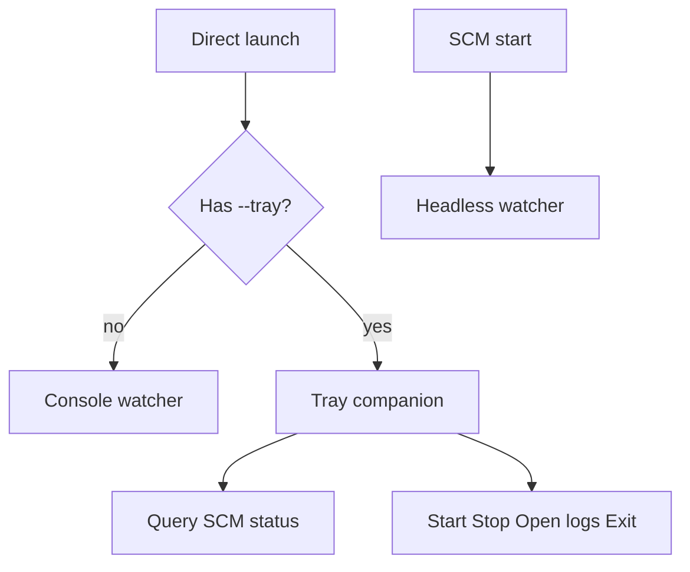

# lgtv-display-sync

A small Windows utility that lets an **LG webOS TV be used as a monitor**: it syncs the
TV's power/screen state to the Windows display state, and wakes the TV over the network.

- Windows turns the display **off** (idle / lock / DPMS) → put the **TV to standby** (or just screen‑off).
- Windows turns the display **on** (mouse / key) → **Wake‑on‑LAN** the TV and turn its screen on.

It can run as a **Windows service** (session 0 / LocalSystem, auto‑start on boot) or as a
**console app** when you launch the exe directly.

---

## Why this exists (the real problem)

This started as a prototype to fix a real, specific setup:

- An **LG OLED** is the machine's **only display**, driven over a **dedicated, isolated Ethernet
  segment** (its own `/24`, no internet) — separate from the PC's internet connection (Wi‑Fi).
  A near air‑gapped topology: the TV link carries just PC↔TV control.
- [ColorControl](https://github.com/Maassoft/ColorControl) handled "display sleeps → TV off,
  wake → TV on" and worked fine.
- After a **VPN** was connected, **waking the TV stopped working**: lock the PC, the display
  sleeps, move the mouse — and the TV screen never comes back. The failure was **reproduced
  only with the VPN connected**; with the VPN off it always worked, on any IP scheme.

The tell‑tale detail: the machine could still `ping` and open a TCP socket to the TV with the VPN
on, so it *looked* reachable — but the control session never established, so no "screen on" was
ever sent.

## What the investigation found

Using packet captures and a purpose‑built, instrumented SSAP probe (see [`probe/`](probe/)) that
times each connect phase separately, the failure was localized precisely:

- The webOS control channel is a **secure WebSocket** (`wss://<tv>:3001`). With the VPN on, the
  handshake **intermittently stalls at the TLS step**: TCP connects instantly, the client sends its
  `ClientHello`, the TV **TCP‑ACKs it but never returns a `ServerHello`** for the whole timeout,
  then RSTs the connection ~15 s later.
- It's **intermittent and clustered** — long stretches connect in ~130 ms, then a "bad period"
  produces a run of stalls. It's aggravated by **connection churn** (each stalled socket lingers on
  the TV for ~15 s, and webOS has a small connection budget).
- Under the conditions we tested, it was **not** explained by the IP scheme, **not** by
  LAN‑vs‑tunnel routing (the control channel stayed on Ethernet with the correct source),
  and **not** simply by source‑binding — a minimal fresh connect still reproduced the stall
  and cleared when the wave passed.

**Why ColorControl's connect strategy struggles here:** ColorControl uses a **5‑second connect
timeout with a burst of retries** at the wake moment, which stalls and storms right through a
bad period. This tool instead does a **fresh connect with a short (~2.5 s) timeout and gentle,
spaced retries** — riding over the stall waves — and keeps at most one warm connection.
Validated end‑to‑end with the VPN connected: real display sleep/wake driving **true power‑off →
WoL power‑on** on its own.

## How it works

| Piece | File | What it does |
|---|---|---|
| Monitor watcher | [`app/MonitorPowerWatcher.cs`](app/MonitorPowerWatcher.cs) | Registers `GUID_CONSOLE_DISPLAY_STATE`; raises display off/on |
| SSAP client | [`app/Ssap.cs`](app/Ssap.cs) | Phased `wss:3001` connect (short timeout), screen/power commands |
| Wake‑on‑LAN | [`app/Wol.cs`](app/Wol.cs) | Magic packet to the TV subnet's directed broadcast, from the matching NIC |
| Key store | [`app/KeyStore.cs`](app/KeyStore.cs) | Own client‑key; first‑run pairing; one‑time migrate from ColorControl |
| Controller | [`app/Program.cs`](app/Program.cs) | Wires events → actions with cancel‑previous + gentle retry |

webOS SSAP used: register/pairing handshake, `.../power/turnOffScreen` · `turnOnScreen`,
`system/turnOff` (standby), plus WoL for power‑on.

This is **not a ColorControl fork** — it is a small rewrite that uses standard webOS SSAP and the
common legacy register handshake. The SSAP transport (phased connect) and retry policy are
original; pairing keys can be migrated from ColorControl for convenience.

## Usage

```bash
# build
dotnet build app -c Debug

# one‑shot tests (no display cycle needed)
app/bin/Debug/net9.0-windows/lgtv-display-sync.exe --test on        # WoL + screen on
app/bin/Debug/net9.0-windows/lgtv-display-sync.exe --test off       # screen off
app/bin/Debug/net9.0-windows/lgtv-display-sync.exe --test poweroff  # TV -> standby
app/bin/Debug/net9.0-windows/lgtv-display-sync.exe --test poweron   # WoL + reconnect

# first‑run pairing (no ColorControl): accept the prompt on the TV
app/bin/Debug/net9.0-windows/lgtv-display-sync.exe --pair

# run it (reacts to display sleep/wake); Ctrl+C to stop
app/bin/Debug/net9.0-windows/lgtv-display-sync.exe

# tray companion — status / Start / Stop for the installed Windows service (no watcher)
app/bin/Debug/net9.0-windows/lgtv-display-sync.exe --tray

# log display OFF/ON only (no SSAP/WoL) — useful for session-0 experiments
app/bin/Debug/net9.0-windows/lgtv-display-sync.exe --watch-only
```

**Config:** copy `app/config.json.example` → `app/config.json` and set your TV's `Ip`, `Mac`, and
`OffAction` (`"power"` for standby, `"screen"` for panel‑off). `config.json` is git‑ignored and is
loaded from the folder next to the exe (so a service `binPath` must point at a build that includes
your real `config.json`).

**Pairing / keys:** on first run with no key, the tool shows a prompt on the TV, waits, and saves
the client‑key under `%ProgramData%\nsoto.dev\lg-tv-display-sync\config\` (shared by console and service).
If a legacy key exists in `%LocalAppData%\lgtv-display-sync\`, that file is still preferred on load
for interactive upgrades. ColorControl keys are migrated into ProgramData `config\` when neither store has a
key yet.

## Windows service (autostart)

Official install uses PowerShell scripts that are **copied into the build output** next to the
exe (elevated). This is **not** the experimental `probe/ctx` session‑0 helpers.

Prerequisites:

1. Build the app and ensure `config.json` sits beside `lgtv-display-sync.exe` in the output folder.
2. Pair once interactively if you do not already have a client key (`--pair`, or let a normal run
   migrate from ColorControl / LocalAppData). The install script copies a LocalAppData key into
   ProgramData when needed so LocalSystem can read it.

```powershell
# Build (Debug or Release — either works; scripts resolve the sibling exe)
dotnet build app -c Release

# From an elevated PowerShell prompt, run the scripts in the output folder:
cd app\bin\Release\net9.0-windows   # or your chosen configuration's output
.\install-service.ps1
.\uninstall-service.ps1
```

`install-service.ps1` registers whatever `lgtv-display-sync.exe` sits next to the script (override
with `-ExePath` only if you intentionally point elsewhere).

| | |
|---|---|
| SCM name | `lgtv-display-sync` |
| Display name | LG TV Power Resume Sync Utility (nsoto.dev) |
| Account / start | LocalSystem / Automatic |
| Logs | `%ProgramData%\nsoto.dev\lg-tv-display-sync\log\log.txt` |

A self‑contained publish layout (single folder you can XCopy) is still a roadmap **P1** chore.

## Status

Working **prototype**, validated end‑to‑end with the VPN connected. Intended as an **interim**
daily driver until ColorControl handles this VPN + TLS‑stall case again.

**How it launches:**



- **SCM / service:** session‑0 headless watcher (official autostart:
  `install-service.ps1` in the build output; source
  [`app/scripts/install-service.ps1`](app/scripts/install-service.ps1)).
- **Direct launch (default):** console watcher (today).
- **`--tray`:** user‑session companion for service status / Start / Stop / open logs / Exit — see
  [`docs/features/service-and-tray.md`](docs/features/service-and-tray.md).

**Next:** P1 chores (ops notes, self‑contained publish) — [`docs/roadmap.md`](docs/roadmap.md).

## Repo layout

```
app/           the utility
app/scripts/   service install / uninstall (copied next to the exe on build)
probe/         instrumented SSAP connect probe used to diagnose the VPN stall
docs/          product roadmap, MVP bar, feature notes
```
